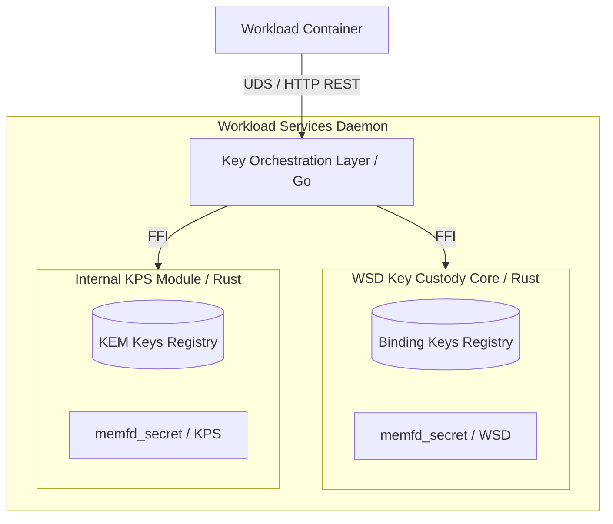
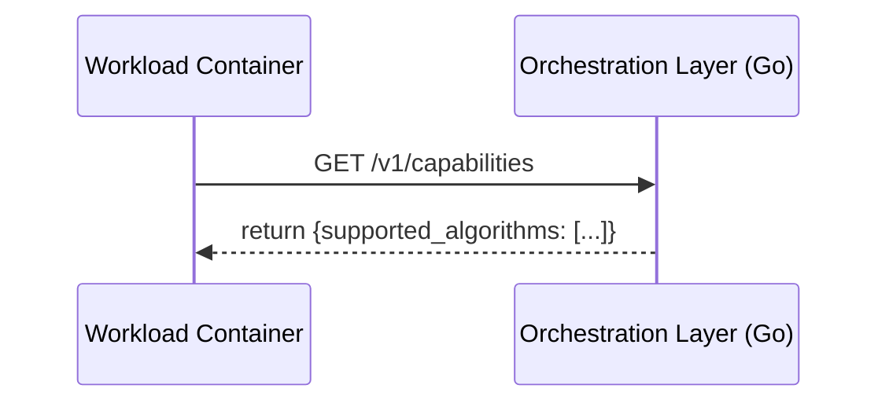
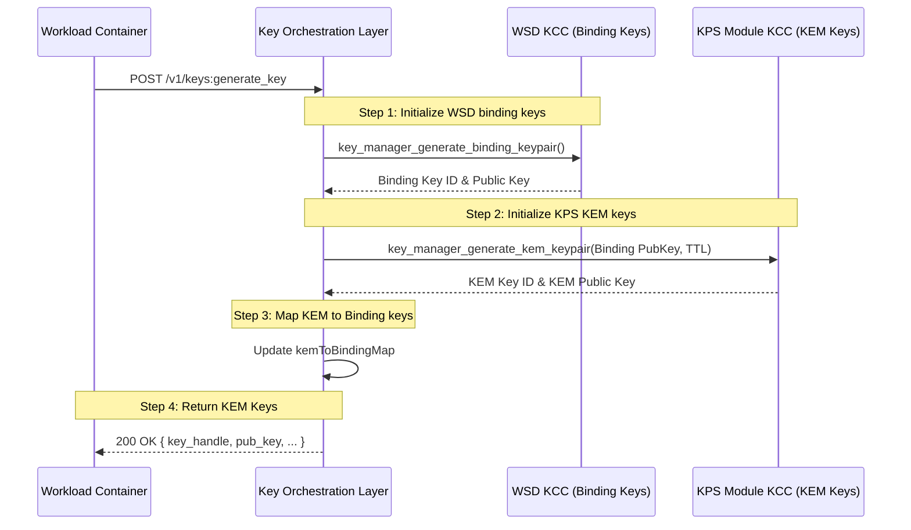
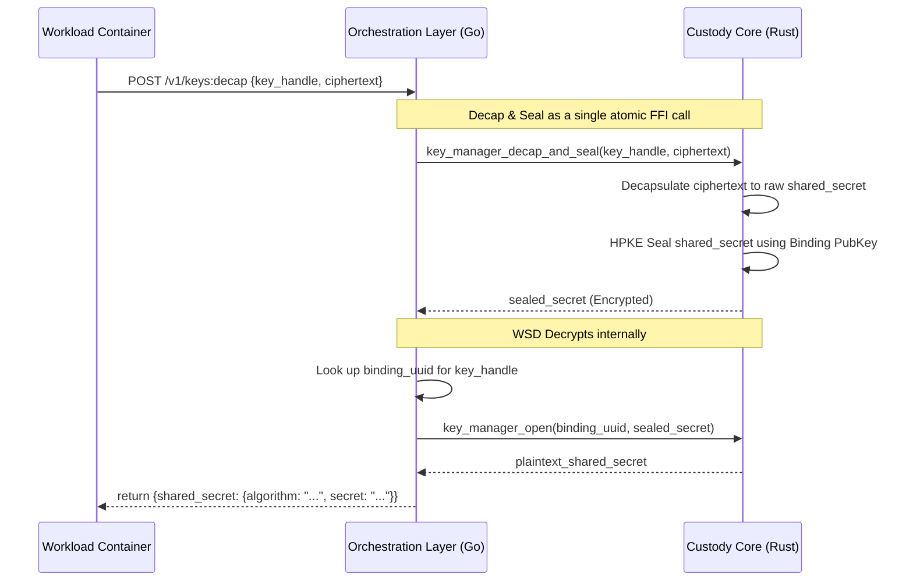
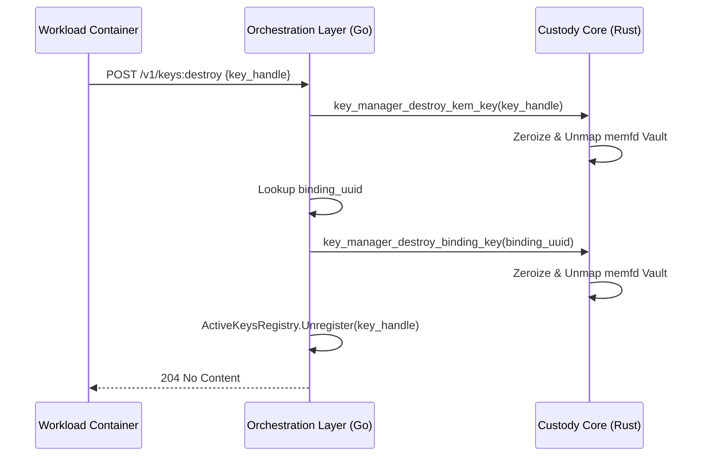

# Key Manager (Key Protection Service)

The Key Manager is a secure cryptographic service designed to provide a secure enclave for key custody and lifecycle management within confidential computing environments (TEEs).

It acts as the bridge between workload containers and secure cryptographic backends, ensuring strict isolation, gated access to sensitive key material, and robust attestation integration.

## Architecture

The Key Manager employs a split architecture to leverage the API concurrency strengths of Golang alongside the low-level memory safety and determinism of Rust.

Both the Workload Services Daemon (WSD) and the Key Protection Service (KPS) modules currently run within the same VM. They maintain separate `KeyRegistry` instances and use different `memfd_secret` pools for isolation.



### 1. Key Orchestration Layer (KOL) - Golang

The KOL serves as the primary external interface. It handles concurrent HTTP REST / gRPC requests from workload containers.

*   **Endpoint Management:** Exposes REST interfaces (transcoded from gRPC) for key lifecycle operations.
*   **Active Key Mapping:** Maintains the `kemToBindingMap` mapping KEM Key handles (UUIDs) to their corresponding Binding Keys.
*   **Protocol Translation:** Converts external API requests into internal FFI calls to the Rust-based KCC and KPS modules.
*   **Security Boundary:** The KOL never has access to raw private key material. Go's garbage collector and stack movement make it unsuitable for handling highly sensitive `memfd_secret` pointers.

### 2. Key Custody Core (KCC) - Rust

The KCC (and the internal KPS module) is a hardened secure core for storing keys and executing cryptographic operations via BoringSSL.

*   **Key Ownership:** Exclusively owns file descriptors for `memfd_secret` pages, ensuring keys remain isolated from the standard virtual address space.
- **Cryptographic Operations:** Performs tasks such as DHKEM decapsulation and HPKE seal/open via FFI to BoringSSL.
*   **Lifecycle Management:** Handles explicit creation, storage in memory-mapped regions removed from the kernel's direct map, and deterministic destruction (zeroizing on drop).
*   **Policy Enforcement:** Enforces strict Time-To-Live (TTL) checks prior to every operation.


## Key Protection Modes

The Key Manager supports different protection modes based on how keys are attested:

- **DEFAULT:** Standard use cases; keys held in WSD with single VM attestation.
- **KEY_PROTECTION_VM_EMULATED:** Both keys held in WSD, but generates two attestations emulating an isolated Key Protection Service architecture.
- **KEY_PROTECTION_VM:** Hardened mode where KEM keys reside in a separate KPS VM with distinct attestations.

## Security Guarantees & Hardening

*   **memfd_secret Backed Storage:** Long-term cryptographic keys are stored in anonymous, memory-backed file descriptors allocated via `SYS_MEMFD_SECRET`. This removes the memory from the kernel's direct map, ensuring it cannot be swapped to disk or easily compromised by memory scraping.
*   **Strict TTL Enforcement:** Keys are bound by a TTL evaluated against `CLOCK_MONOTONIC` to protect against NTP-based attacks. The KCC checks key liveness before every crypto operation. A background reaper thread routinely sanitizes expired keys.
*   **Stack Clearing:** Cryptographic functions are wrapped with `clear_stack_on_return` to ensure intermediate secret values do not linger in memory after a function completes.
*   **Seccomp-BPF Sandboxing:** The KCC's execution environment is locked down using strict BPF filters. Syscalls like `fork`, `execve`, and `open` are blocked to mitigate RCE vulnerabilities.

## Key Types

The service manages the following cryptographic key types:

*   **KEM Keys (Receiver):** Key Encapsulation Mechanism keys (e.g., `DHKEM_X25519_HKDF_SHA256`) shared with a Trusted Proxy to establish shared secrets.
*   **Binding HPKE Keys:** Internal keys used to securely transfer the decapsulated secret back to the workload orchestration layer.

## Core Workflows

### 1. Capabilities Discovery

Before generating keys, a workload can query the service to discover supported cryptographic algorithms and mechanisms. This flow is initiated by calling the [`GET /v1/capabilities`](#get-capabilities) endpoint.



### 2. Key Generation

When a workload requests a new KEM key, the system coordinates the creation of both an internal Binding key in the WSD and an external-facing KEM key in the KPS module. This workflow is triggered by a call to the [`POST /v1/keys:generate_key`](#generate-key) endpoint.



### 3. Key Exchange (Decap & Seal)

The exchange operation is a secure "Decapsulate and Seal" handshake, initiated by the [`POST /v1/keys:decap`](#decapsulate-decap) endpoint. This guarantees the raw shared secret never exists in the Go orchestration layer's memory unencrypted.



### 4. Key Destruction

Workloads can proactively trigger key deletion via the [`POST /v1/keys:destroy`](#destroy-key) endpoint. This action drops the Vault and unmaps the memfd_secret pages immediately.




## Attestation Integration (Key Claims)

The Key Manager exposes internal goroutine channels to supply the TEE Attestation Service with Key Claims (`VmProtectionBindingClaims`, `VmProtectionKeyClaims`).

The `ActiveKeysRegistry` allows the Attestation service to query the metadata (public keys, TTLs, and cryptographic specs) necessary to bake the keys into hardware-rooted attestation quotes (e.g., using a vTPM or AMD SEV-SNP report) proving the keys originated within an authentic confidential VM.

## Build and Test

Because the Key Manager leverages a split Go/Rust architecture and relies on advanced Linux kernel features, specific prerequisites are required to build and test the project.

### Prerequisites

*   **Linux Environment:** A Linux kernel 5.14 or newer is required to support the `SYS_MEMFD_SECRET` syscall.
*   **Golang:** Go 1.20+ installed.
*   **Rust:** A recent stable Rust toolchain (via rustup).
*   **C Compiler:** gcc or clang for CGO and FFI linking.
*   **Dependencies:** BoringSSL headers (provided in `third_party/bssl-crypto` and `boringssl`).

### Building

The build process requires compiling the Rust Key Custody Core as a library first, which is then linked via CGO to the Golang Key Orchestration Layer.

```bash
# 1. Build the Rust workspace
cargo build --release

# 2. Build the Golang Orchestration Layer
# Ensure CGO is enabled to link the Rust library
CGO_ENABLED=1 go build -o keymanager ./cmd/...
```

### Testing

Tests should be run in a Linux environment capable of executing the `memfd_secret` syscall, otherwise custody allocation tests will fail.

```bash
# Run Rust unit tests
cargo test

# Run Go unit and integration tests
CGO_ENABLED=1 go test -v ./...
```

## API Reference

The Key Protection Service API manages keys and performs cryptographic operations. The service is exposed over a local Unix Domain Socket (UDS), and workloads can interact with it using a standard HTTP client.

### Get Capabilities
Retrieves the list of cryptographic algorithms supported by the service. This allows a client to discover which Key Encapsulation Mechanisms (KEMs) are available before requesting a key.

For a conceptual overview, see the [Capabilities Discovery Workflow](#1-capabilities-discovery).

**Method**: `GET /v1/capabilities`

**Response**:
- `200 OK`: A successful request returns a list of supported KEM algorithms.
```json
{
  "supported_algorithms": [
    {
      "algorithm": {
        "type": "kem",
        "params": {
          "kem_id": "DHKEM_X25519_HKDF_SHA256"
        }
      }
    }
  ]
}
```

### Generate Key
Orchestrates the creation of a new KEM keypair. The private key is retained within the secure Key Custody Core, while a unique `key_handle` (UUID) is returned to the caller. This handle is used to reference the key in all subsequent operations.

For a detailed sequence diagram of this process, see the [Key Generation Workflow](#2-key-generation).

**Method**: `POST /v1/keys:generate_key`

**Request Body**:
```json
{
  "algorithm": {
    "type": "kem",
    "params": {
      "kem_id": "DHKEM_X25519_HKDF_SHA256"
    }
  },
  "lifespan": 3600
}
```
- `lifespan`: The key's lifetime in seconds. After this duration, the key will be automatically destroyed.

**Response**:
- `200 OK`: Returns the key handle, public key, and metadata.
```json
{
  "key_handle": {
    "handle": "123e4567-e89b-12d3-a456-426614174000"
  },
  "pub_key": {
    "algorithm": {
      "type": "kem",
      "params": {
         "kem_id": "DHKEM_X25519_HKDF_SHA256"
      }
    },
    "public_key": "<Base64 encoded bytes>"
  },
  "key_protection_mechanism": "KEY_PROTECTION_VM_EMULATED",
  "expiration_time": 12345678
}
```

### Enumerate Keys
Lists all active KEM keys currently managed by the daemon, including their handles, public keys, and remaining lifespans. This is useful for clients that need to manage or inspect multiple keys.

**Method**: `GET /v1/keys`

**Response**:
- `200 OK`: Returns a list of `key_infos` objects.
```json
{
  "key_infos": [
    {
      "key_handle": {
          "handle": "123e4567-e89b-12d3-a456-426614174000"
      },
      "pub_key": {
        "algorithm": {
          "type": "kem",
          "params": {
            "kem_id": "DHKEM_X25519_HKDF_SHA256"
          }
        },
        "public_key": "<Base64 encoded bytes>"
      },
	  "key_protection_mechanism": "KEY_PROTECTION_VM_EMULATED",
      "remaining_lifespan": 3500
    }
  ]
}
```

### Decapsulate (Decap)
Performs a decapsulation operation using the private key corresponding to the given `key_handle`. This is the primary cryptographic function of the service, allowing the workload to obtain a shared secret that was established with a trusted proxy.

The internal "Decap and Seal" process is detailed in the [Key Exchange Workflow](#3-key-exchange-decap--seal).

**Method**: `POST /v1/keys:decap`

**Request Body**:
```json
{
  "key_handle": {
    "handle": "123e4567-e89b-12d3-a456-426614174000"
  },
  "ciphertext": {
    "algorithm": "DHKEM_X25519_HKDF_SHA256",
    "ciphertext": "<Base64 encoded encapsulated shared secret>"
  }
}
```

**Response**:
- `200 OK`: Returns the plaintext shared secret.
```json
{
  "shared_secret": {
    "algorithm": "DHKEM_X25519_HKDF_SHA256",
    "secret": "<Base64 encoded bytes>"
  }
}
```

### Destroy Key
Manually triggers the immediate and secure destruction of a keypair before its natural lifespan expires. This is an irreversible operation.

For a diagram of the destruction sequence, see the [Key Destruction Workflow](#4-key-destruction).

**Method**: `POST /v1/keys:destroy`

**Request Body**:
```json
{
  "key_handle": {
    "handle": "123e4567-e89b-12d3-a456-426614174000"
  }
}
```

**Response**:
- `204 No Content`: Indicates the key was successfully destroyed.
